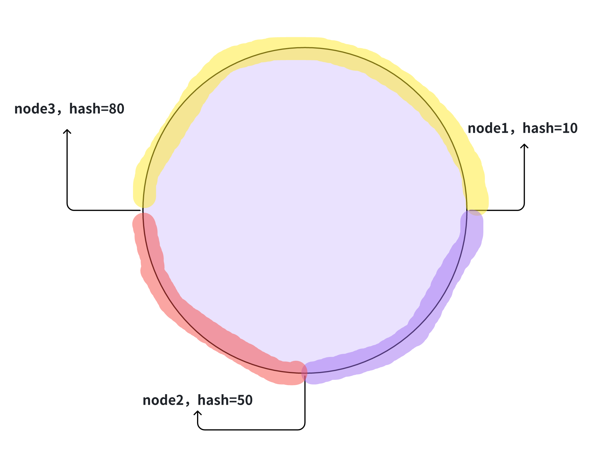
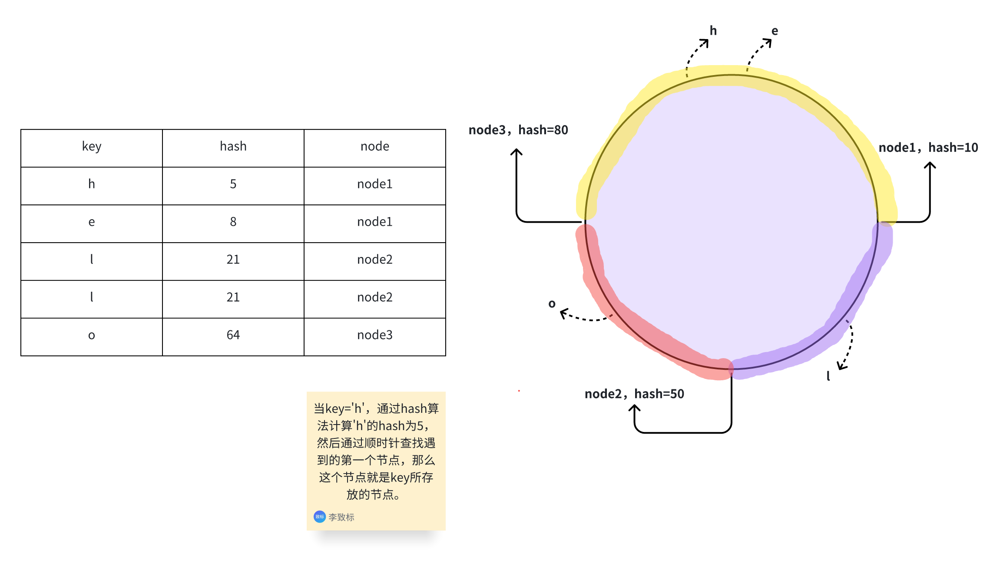
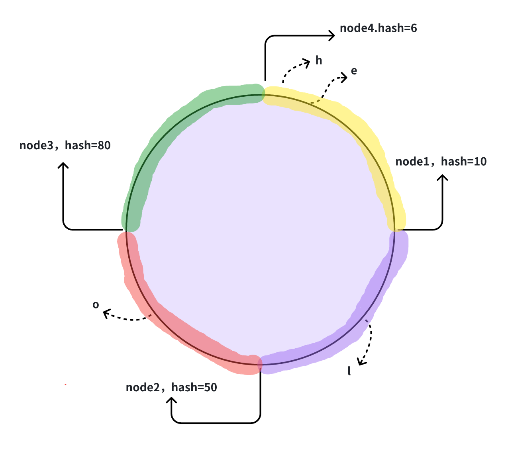
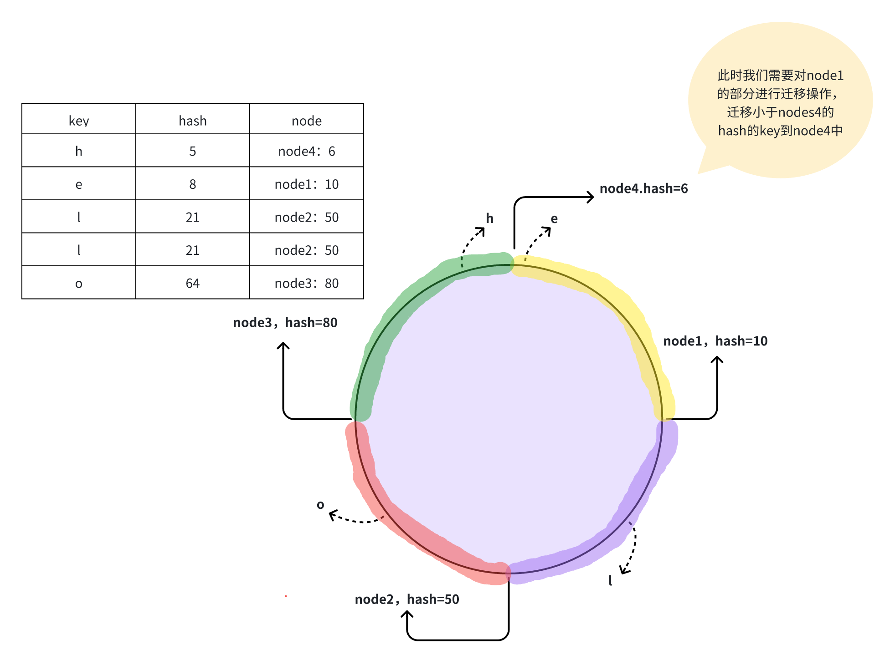
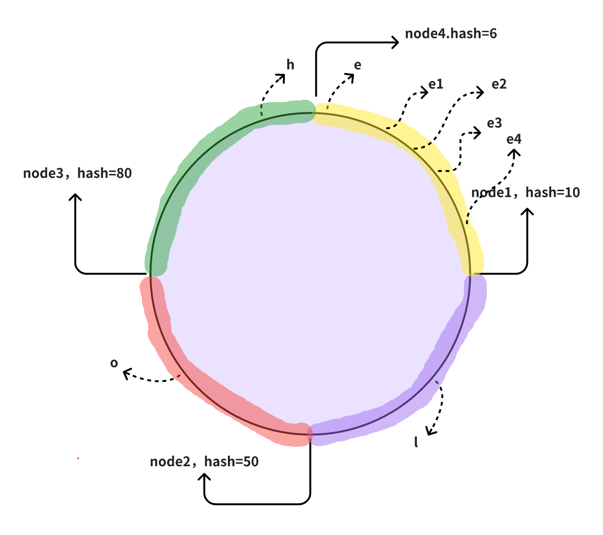
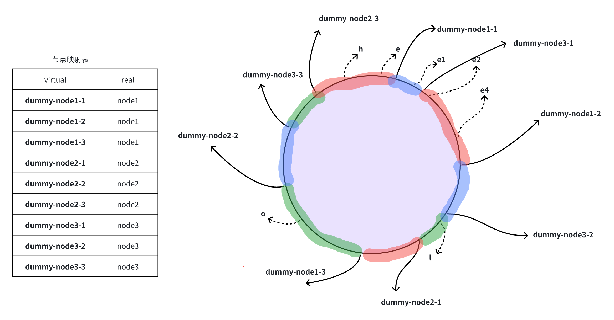

# 一致性hash实现
## 什么是一致性hash

一致性哈希算法是一种特殊的哈希算法，它设计用于分布式系统中处理节点动态变化的情况，比如节点的添加或移除。这种算法的主要优点在于它能够**最小化**节点变化时数据重分布的范围，从而减少了数据迁移的成本。

### 解决了什么？

-   数据迁移成本
-   负载均衡
-   节点变化时的数据一致性
-   缓存雪崩问题
-   可扩展性

接下来我们就进行一一探究是如何解决的。


## 如何实现一致性hash

一致性哈希算法将 key 映射到 2^32 的空间中，将这个数字首尾相连，形成一个环。

### 创建hash环，且加入节点

-   对于节点而言，可以通过节点名称+节点ip进行区hash值，放置在环上。


### 将key放入对应的节点

-   计算 key 的哈希值，放置在环上，顺时针寻找到的第一个节点，就是应选取的节点/机器。



### 添加新节点

-   进行添加节点node4




-   此时如果在去进行访问，`key=h`的时候通过hash计算，于是顺时针找到第一个节点node4，此时就会发现node4，不存在`key=h`的值，因为在一开始`key=h`是缓存在node1节点上的，由于新增的node4节点，导致节点变化时的数据一致性问题，那么就需要在新增节点的时候进行迁移操作。


### 删除节点

删除节点和添加节点类似，但是需要将节点缓存的全部key，放入到当前节点hash环的前一个节点上。


### 如何迁移呢？

-   如果新节点的位置正好在环的起始点（即最大哈希值之后），则需要迁移的数据将是环上从最大哈希值到新节点之间的数据。
-   如果新节点的位置在环的中间某处，那么需要迁移的数据就是从新节点到前一个节点之间的数据。





> 这样就解决了节点变化的**数据一致性问题**和**可扩展性**问题，且**数据迁移** **成本低。** 只需要进行迁移小部分符合新节点的key。其实在这里也避免**缓存雪崩问题：** 在传统的简单对hash取模的情况下，如果移除了某一节点，那么之前的`hash % n`变成了`hash % (n-1)`，就意味着几乎缓存值对应的节点都发生了变化，缓存全都失效。导致缓存雪崩。

**已解决问题**

-   数据一致性问题
-   可扩展性
-   数据迁移成本
-   缓存雪崩

### 数据倾斜问题

如果服务器的节点过少，容易引起 key 的倾斜。



如上图key：[e1,e2,e3,e4]都发布node1上，导致其他节点比较稀疏，node1节点key过多导致数据倾斜的问题了。

#### 如何解决呢？

其实可以通过添加节点来避免数据倾斜问题，使这些key避免均匀落在其他node上。但是添加机器成本上是很大的。如何解决呢？其实很简单，可以通过虚拟节点来解决，通过虚拟节点映射真实节点，就可以避免通过添加真实节点造成的代价。来解决节点较少的情况下数据倾斜的问题。且代价非常的小，只需要虚拟节点与对应的真实节点做映射关系即可。



**已解决问题**

-   数据一致性问题
-   可扩展性
-   数据迁移成本
-   缓存雪崩
-   负载均衡

### 总结

到这里一致性hash就说完了，接下来我们通过代码进行实现。


## 实现

### 构造方法

```

type Consistent struct {
    hash    func(key []byte) uint32 
    replica int            // 每个节点虚拟节点的个数
    nodes   []int          // 节点列表 sorted
    mp      map[int]string // 虚拟节点与真实节点的映射
}

func NewConsistent(replica int, hash func(key []byte) uint32) *Consistent {
    c := &Consistent{
       replica: replica,
       hash:    hash,
       mp:      make(map[int]string),
    }
    if hash == nil {
       c.hash = crc32.ChecksumIEEE
    }
    return c
}
```

### 添加与创建节点

```
func (c *Consistent) Add(nodes ...string) {
    for _, node := range nodes {
       for i := 0; i < c.replica; i++ {
          // replica-name
          key := int(c.hash([]byte(fmt.Sprintf("%s%d", node, i))))
          c.nodes = append(c.nodes, key)
          c.mp[key] = node // mapping
          log.Printf("add node:%s, key:%d", node, key)

       }
    }
    sort.Ints(c.nodes) // 在环上进行排序，方便后期进行通过二分法查找key在哪一个node上
}
```

### 获取节点

```

func (c *Consistent) Get(key string) string {
    if len(c.nodes) == 0 {
       return ""
    }
    hash := int(c.hash([]byte(key)))
    // 二分查找，查找大于该key的hahs值的第一个节点
    index := sort.Search(len(c.nodes), func(i int) bool {
       return c.nodes[i] >= hash
    })
    return c.mp[c.nodes[index%len(c.nodes)]]
}
```

### 完整示例

```
package consistenthash

import (
    "fmt"
    "hash/crc32"
    "log"
    "sort"
)

type Consistent struct {
    hash    func(key []byte) uint32
    replica int            // 每个节点虚拟节点的个数
    nodes   []int          // 节点列表 sorted
    mp      map[int]string // 虚拟节点与真实节点的映射
}

func NewConsistent(replica int, hash func(key []byte) uint32) *Consistent {
    c := &Consistent{
       replica: replica,
       hash:    hash,
       mp:      make(map[int]string),
    }
    if hash == nil {
       c.hash = crc32.ChecksumIEEE
    }
    return c
}

func (c *Consistent) Add(nodes ...string) {
    for _, node := range nodes {
       for i := 0; i < c.replica; i++ {
          // replica-name
          key := int(c.hash([]byte(fmt.Sprintf("%s%d", node, i))))
          c.nodes = append(c.nodes, key)
          c.mp[key] = node // mapping
          log.Printf("add node:%s, key:%d", node, key)

       }
    }
    sort.Ints(c.nodes) // 在环上进行排序
}
func (c *Consistent) Get(key string) string {
    if len(c.nodes) == 0 {
       return ""
    }
    hash := int(c.hash([]byte(key)))
    index := sort.Search(len(c.nodes), func(i int) bool {
       return c.nodes[i] >= hash
    })
    return c.mp[c.nodes[index%len(c.nodes)]]
}
```

## 总结

在传统的计算key的位置时，我们通过取模的方式获取，对应的节点。虽然这样的方式非常的高效算法实现简单，但是对于添加或者删除节点时，取模运算的值也会随节点的个数而改变，这样就造成了所有key对应的节点失效的情况，导致所有缓存失效。为了避免这样的情况我们通过引入一致性hash的概念，避免了添加节点造成全部缓存失效的局面，在新增节点时我们需要将处于该节点的key进行迁移到新的节点上，可能在迁移的过程中，进行对key访问出现短暂的key不存在问题。此外为了避免数据倾斜的问题，我们通过虚拟节点的方式映射真实节点，这样一来我们可以通过添加合适的虚拟节点数量，避免数据倾斜在一个节点上的问题（这里也取决于实现的hash方法）。

**参考**

-   https://xiaolincoding.com/os/8_network_system/hash.html
-   https://geektutu.com/post/geecache-day4.html