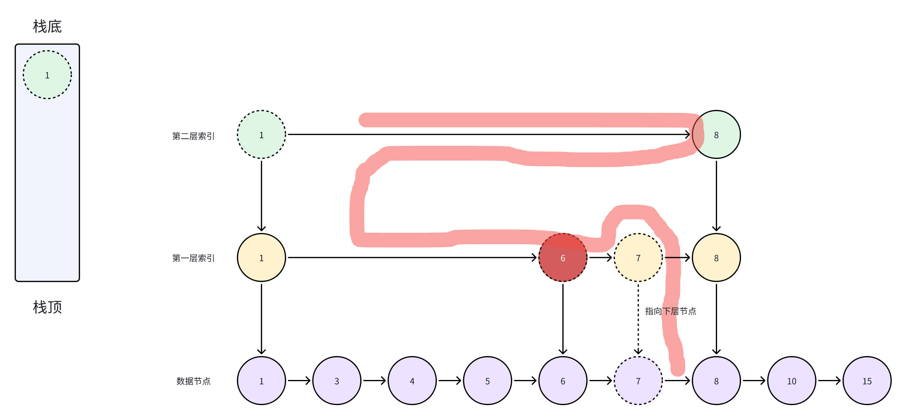

## 为什么需要跳表？

对于单链表，即使存储的是有序的数据，但是想要找到某个元素时，也只能从头到尾的遍历，查找效率低`O(N)`。不能像普通数组通过二分查找`O(logN)`，来提高查找效率。于是就出现了跳表，个人认为跳表是对链表的改进，通过建立索引的思想，来进行加快检索元素。接下来我们就来进行为链表建立索引。


## 如何建立索引？

针对于查找元素时我们肯定是根据小范围找大范围，如下图：


我们需要查找元素5，在传统的链表里我们只能通过头到尾的遍历寻找（红色路径）。如果在建立了索引的基础上进行寻找，那么我们只需要访问三次路径就能找到元素（蓝色路径），这里有点类似于二分查找的过程，但还是取决于索引的建立方式。

### 那么该如何建立索引呢？

其实我们可以在插入元素时，是否决定向上建立索引。我们进行插入元素：7,10。在插入7时触发建立索引的条件。那么我们在7向上建立索引，且与前一个索引链起来。


这样在需要查找10的时候，我们可以通过第一层索引快速找到10这个元素。

### 问题来了

如果插入节点时都符合向上插入节点的条件，那么是不是就相当于和没有添加索引的查找方式一样呢？

如下图：


针对于这样的情况取决我们`向上插入的算法决定`，但是我们也可以通过建立多级索引来进行避免，减少遍历节点的个数。

如下图：


这样我们通过建立多级索引的方式来避免单层索引负担过大，导致索引与数据数量成正比。当然并不是索引建立的越多越好，索引的层次越多，那么插入和数据占用的成本越大。因此我们可以合适的限定索引层次，当超过索引层次时就不进行往上建立索引。

## 模拟插入元素的过程


-   插入元素4，不建立索引的情况下

我们需要通过顶级索引依次向下或者向右判断是否处于该索引上。


-   插入元素7


### 那此时如何进行向上插入索引呢？

1.  我们需要按原来寻找索引的路径的层次建立索引。那么我们需要进行记录访问进入下一层的索引节点。然后在插入成功时按原路返回逐个建立索引，除了数据节点外。


2.  如下图标有虚线的节点也就是我们进入下一个节点的路径，那么建立索引一定是参处于该层节点之后的。我们需要通过进行记录返回路径的节点，那么我们可以使用栈数据结构进行记录返回路径节点。


3.  出栈一个节点然后找到该节点小于该元素的第一个节点，我们就在这里建立索引，然后建立的索引指向下层节点。


4.  然后通过判断是否继续向上建立索引。如果无需再进行建立，则插入完成。若还需要建立索引，回到3步骤，直到索引层次达到限制索引层数。插入完毕。


## 模拟删除

在删除的过程中，我们只需要置零该节点，无需移除索引。这样一来避免了破坏了索引的结构。




1.  删除节点7，我们需要找到7这个节点，然后标记该节点为删除的，清理节点数据。无需进行清理索引节点数据，索引节非数据节点


## 代码实现

### 构造方法

```

type SkipNode struct {
    Key         int
    Val         interface{} // 数据
    Right, Down *SkipNode
    IsDelete    bool
}

func NewSkipNode(key int, val interface{}) *SkipNode {
    return &SkipNode{Key: key, Val: val}
}

type SkipList struct {
    Head     *SkipNode
    Level    int         // 当前跳表索引层数
    Random   func() bool // 用于判断是否建立索引
    MaxLevel int         // 最大层，MaxLevel越大所建造的索引越大，占用的空间也越大
}
```

### 查找节点

```
func (s *SkipList) search(key int) *SkipNode {

    dummy := SkipNode{Right: s.Head}
    cur := dummy.Right
    for cur != nil {
       if cur.Right == nil { // 右侧没有向下找
          cur = cur.Down
       } else if cur.Right.Key > key { // 需要向下找
          cur = cur.Down
       } else if cur.Right.Key == key { // 找到了
          return cur.Right
       } else { // 右侧比较小，向右
          cur = cur.Right
       }
    }
    return nil
}
func (s *SkipList) Search(key int) *SkipNode {
    if node := s.search(key); node != nil && !node.IsDelete {
       return node
    }
    return nil
}
```

### 插入节点

```
func (s *SkipList) Add(k int, v interface{}) {
    // if exist to update
    node := s.search(k)
    if node != nil {
       node.IsDelete = false
       node.Val = v
       return
    }
    // set
    var stack []*SkipNode
    dummy := SkipNode{
       Right: s.Head,
    }
    cur := dummy.Right // head
    // find the insert position
    for cur != nil {
       if cur.Right == nil { //右边没有向下操作
          stack = append(stack, cur)
          cur = cur.Down // 要么就是head的下，要么就是前一个节点的下
       } else if cur.Right.Key > k { // 需要下降寻找
          stack = append(stack, cur)
          cur = cur.Down
       } else {
          // 向右
          cur = cur.Right
       }
    }
    // 找到插入位置了
    var level int
    var downNode *SkipNode
    for len(stack) != 0 {
       val := stack[len(stack)-1] //插入节点的左节点
       stack = stack[:len(stack)-1]
       node := NewSkipNode(k, v)
       node.Down = downNode
       downNode = node
       node.Right = val.Right
       val.Right = node
       // 如果大于了最大索引就不建立，是否需要向上建立索引

       if level < s.MaxLevel && !s.Random() {
          return
       }

       level++
       //创建头，因为到达了最顶level但是没有超过MaxLevel
       if level > s.Level {
          s.Level = level
          // x需要创建一个新的节点
          node := NewSkipNode(math.MinInt32, math.MinInt32)
          node.Down = s.Head
          s.Head = node
          stack = append(stack, node)
       }
    }
}
```

### 删除节点

```
func (s *SkipList) Delete(key int) (node *SkipNode) {
    dummy := SkipNode{Right: s.Head}
    cur := dummy.Right
    for cur != nil {
       if cur.Right == nil {
          cur = cur.Down
       } else if cur.Right.Key > key {
          cur = cur.Down
       } else if cur.Right.Key == key {
          node = cur.Right
          //cur.Right = cur.Right.Right // 清理节点
          cur.Right.IsDelete = true
          cur = cur.Down
       } else {
          cur = cur.Right
       }
    }
    return
}
```

## 总结

跳表通过引入多级索引来提高了链表的操作效率，并且在实现上相对简单。通过随机化（不一定是随机化，也可以通过具体的算法来实现算法向上插入索引，从而更好的控制索引的效率）选择索引层级，可以保证在大多数情况下具有良好的性能表现。

### 在实际应用中

-   Redis 的有序集合 ZSET 就采用了跳表作为底层数据结构之一。

**为什么在** **MySQL** **不使用** **Skiplist** **作为** **索引** **，而Redis的Zset使用了SkipList呢？**

首先MySQL 主要面向磁盘存储，而磁盘访问的特点是随机访问慢，连续访问快。B+树的特性非常适合磁盘存储，因为它能够减少磁盘 I/O 操作次数。再加上B+树矮胖，也意味着根节点到叶子节点距离短，减少了磁盘I/O次数。且叶子节点相互链接，更有利于范围查询。

而对于Redis的Zset选择SkipList，它的数据结构设计更加注重内存访问效率。Skiplist 非常适合内存访问，因为内存访问速度快，随机访问成本相对较低。相对于B+树，跳表更易于实现。但在Redis的Zset并不是一上来就是使用SkipList的而是需要达到特定数量的key时才会选择。在没有满足条件时，底层数据结构是压缩表（ziplist）。